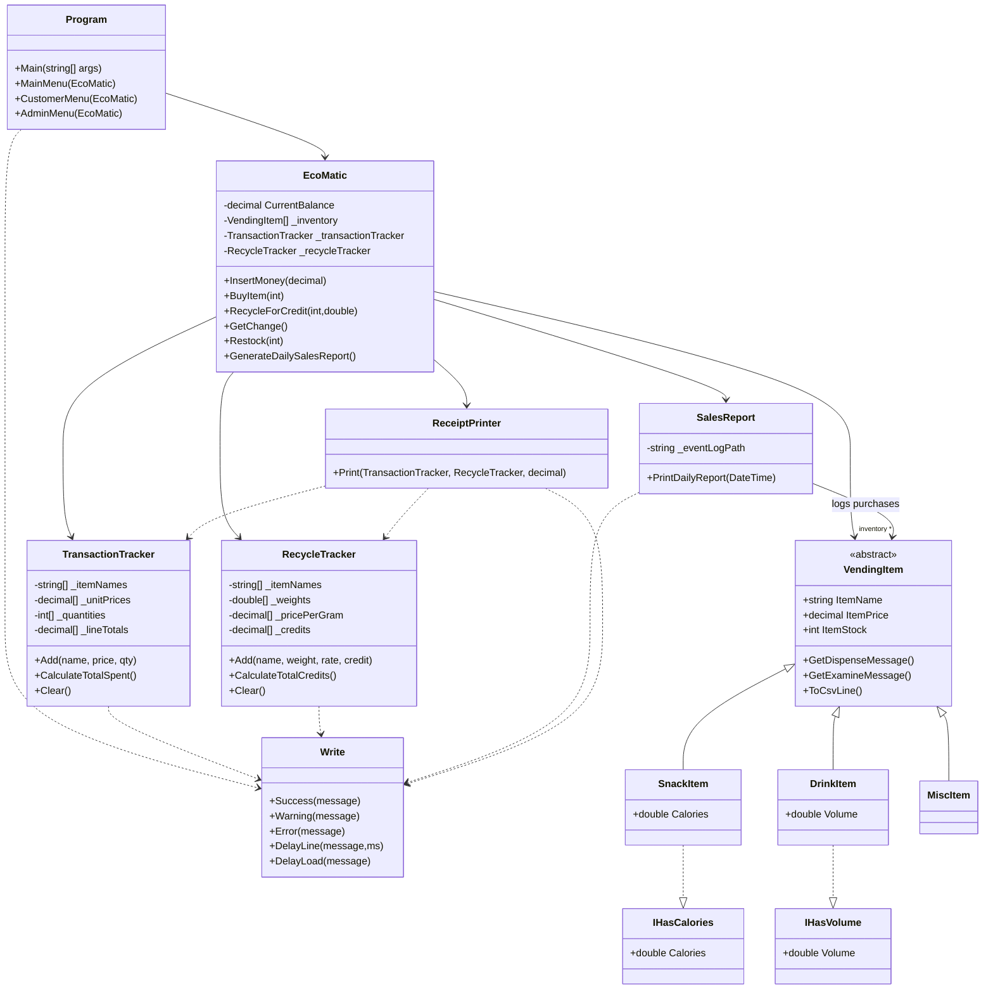

# Eco-Matic: Eco Vending Machine Console Application 

## DEMO

## I. Project Title

**Eco-Matic** (Eco vending machine using Console Application in C#)

## II. Introduction

This project aims to develop a console **"Eco-Matic" Vending Machine Simulator** in C#. The application will show the use of different OOP principles and file handling. The idea came from not just for commercial purposes but also to integrate a "trash to credit" recycling system, promoting awareness of Sustainable Development Goals (SDGs) like responsible consumption (SDG 12).

This project can potentially be a great idea in the future to be put on the streets of Cebu to help clean the trashes. The console program will be **data-driven**, with a **dynamic inventory** managed through a CSV file and a transaction log.

## III. Objectives

- **Develop a user-friendly and interactive console application** with clear, separated roles for customers and administrators.
- **Demonstrate inheritance and polymorphism** by creating an abstract `VendingItem` class with specialized child classes (`DrinkItem`, `SnackItem`) that provide unique behaviors.
- **Implement a data-driven inventory** that loads and saves its state from a CSV file, allowing the machine's catalog to be modified dynamically.
- **Create an admin panel**, protected by a code, for managing the machine's inventory and logs.
- **Integrate a "Recycle for Credit" feature**, allowing users to convert simulated trash (plastic, glass, aluminum) into usable machine credit, thus promoting sustainability.
- **Enforce realistic constraints**, such as a maximum number of item slots and maximum stock per item, with input validation to guide the user.

## IV. Scope

### What's Included:
- **Customer Transactions**: Simulates customer interactions (purchasing, recycling)
- **Dynamic Inventory Management**: Real-time inventory updates with CSV persistence
- **Administrative Functions**: Managing inventory, viewing logs, and generating reports
- **Console-based UI**: Simple, intuitive menu-driven interface

### What's Not Included:
- The system will focus on simulating customer transactions (purchasing, recycling), managing a dynamic inventory, and providing administrative functions.
- The system will **not include a GUI**. It will only be purely console-based.

## V. Project Requirements

### Software Requirements:
- **IDE**: Visual Studio Code or Visual Studio 2022 (Or any IDE with C# environment)
- **Language**: C#
- **Tools/Libraries**: 
  - Standard .NET libraries, including System.IO for file handling
  - System.Linq for data manipulation
  - System.Threading for sleep function
  - **Spectre.Console** for colored console output and table formatting

### Hardware Requirements:
- Any modern computer capable of running the .NET runtime

## VI. Functional Requirements

### Customer Functions:
- **Insert Money**: Allow a user to add to their current balance
- **Select Item**: Allow a user to purchase an available item if they have sufficient balance
- **Examine Item**: Display descriptive "flavor text" for a selected item
- **Recycle for Credit**: Allow a user to select a type of recyclable material and quantity to add credit to their balance
- **Get Change**: Allow a user to finish their session and receive their remaining balance

### Administrator Functions:
- **Restock Items**: Restore the quantity of a specific item to the maximum stock level (10)
- **Add Item**: Add a new, unique item to the machine's inventory (up to the 6-item limit), defining its type, name, price, stock, and attributes
- **Remove Item**: Permanently remove an item from the machine's inventory
- **View Log**: Display the complete contents of the transaction log file
- **Clear Log**: Wipe all entries from the transaction log file after a confirmation prompt
- **Sales Report**: View daily sales metrics with item quantities sold and total revenue

### System Functions:
- **Data Persistence**: Automatically load and save the inventory from/to a CSV file
- **Event Logging**: Automatically log all purchases, recycling activities, and admin actions with a UTC timestamp (Using DateTime from System)
- **Input Validation**: Guide users to re-enter data if their input is invalid (negative prices, out-of-range stock levels)

## VII. Features Implemented

### ✅ Customer Mode:
- Insert money with bill validation
- Browse and purchase items
- Examine item details with flavor text
- Recycle items for credit (plastic, glass, aluminum)
- Get change and receive receipt
- Receipts consolidate identical purchases and recycled items into single lines
- Real-time balance tracking

### ✅ Admin Mode:
- Password-protected admin panel (`admin123`)
- Restock items to max capacity
- Add new items (snack/drink/misc) with auto-fill to max stock
- Remove items from inventory
- View complete event log
- Clear event log with confirmation
- Daily sales report with revenue metrics

### ✅ System Features:
- CSV-based data persistence with auto-repair
- Complete transaction logging with timestamps
- Colorized console output with Spectre.Console
- Stock level indicators (visual dots and numeric)
- Input validation and error handling
- Array-based data structure (no Lists/Dictionaries)

## VIII. OOP Concepts Demonstrated

- **Inheritance**: VendingItem → SnackItem, DrinkItem, MiscItem
- **Polymorphism**: Abstract methods implemented in child classes
- **Encapsulation**: Private fields with public properties
- **Abstraction**: Abstract base class and interfaces
- **Interface Implementation**: IHasVolume, IHasCalories

## IX. Sustainable Development Goal (SDG) Connection

This project promotes **SDG 12: Responsible Consumption and Production** by:
- Integrating a "trash to credit" recycling system
- Encouraging sustainable habits through gamification
- Raising awareness about proper waste management
- Creating a practical solution for trash collection and incentivization

## X. Areas for Improvement

### To Refactor:
- **Transaction Tracking Arrays**: I'm using too many parallel arrays (`_transactionItemNames[]`, `_transactionPrices[]`, etc.). I should consolidate these into a `Transaction` class
- **Code Organization**: Everything is in one `Program.cs` file. I should split my classes into separate files to make the codebase more maintainable
- **Magic Numbers**: I have hardcoded constants scattered around (array sizes, stock thresholds). I should extract these to class-level constants for easier adjustments
- **Sales Report**: My report only shows basic metrics. I could enhance it to display insights like best-selling items or item type breakdown

### To Implement:
- **Advanced Reporting**: I want to add features like multi-day sales reports, inventory valuation, and restock history
- **Recyclable Item Configuration**: Instead of hardcoding recycling rates, I should make them configurable
- **Search/Filter for Logs**: I want to add the ability to filter event logs by date, item name, or transaction type (this is gonna be hard fsfs)

## XI. Author Notes

This is a midterm project demonstrating core C# and OOP principles through a practical, interactive console application. The code emphasizes proper data handling, and user-friendly design while maintaining a focus on sustainability and social responsibility.

## XII. Class Diagram

## License

This project is licensed under the **MIT License** - see the [LICENSE](LICENSE) file for details.
